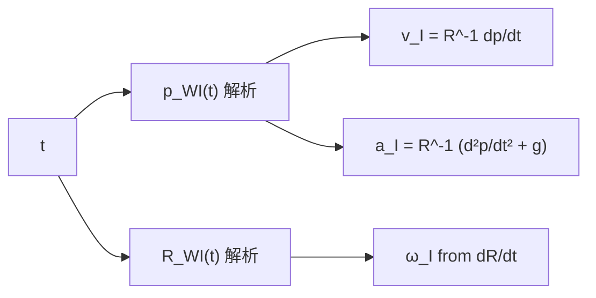
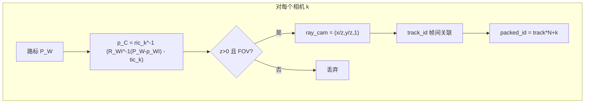

# DataGenerator 观测生成原理

`DataGenerator` 在**世界系**下维护一条已知的 IMU 轨迹，并在固定三维路标场上，按相机外参投影生成**归一化射线**形式的视觉观测。IMU 与图像观测共用同一时间轴，供 `simulation_standalone` 或 `data_generator/vis` 调试使用。

源码入口：`src/data_generator.{h,cpp}`，配置：`src/data_generator_options.h`、`src/data_generator_config.cpp`。

---

## 1. 坐标系与符号

| 符号 | 含义 |
|------|------|
| 世界系 `{W}` | 仿真全局坐标，路标 `pts_` 固定在此系 |
| IMU 体系 `{I}` | 与 `getRotation()` / `getPosition()` 一致，原点在 IMU |
| 相机系 `{C_k}` | 第 `k` 个 slot 的相机（`k = 0 .. num_cam-1`） |
| `R_WI`, `p_WI` | IMU 相对世界的旋转、位置（`getRotation()`、`getPosition()`） |
| `ric_k`, `tic_k` | **IMU → 相机** 外参：`p_I = ric_k * p_C + tic_k`（与 VINS `ExtrinsicState` 一致） |

多目时，外参来自 `simulation_config.yaml` 的 `cam_chain` / `cam_chain-imucam`，经 `readParameters()` 链式合成后写入 `DataGeneratorOptions::ric/tic`，**不在** `getImage()` 内再读 Kalibr 文件。

---

## 2. 时间轴与调用节奏

```
t = 0
loop:
  读取 getTime() 上的 IMU 量（acc, gyr, …）
  每 imu_per_img 次 update 调用一次 getImage()
  update()  →  t += 1/FREQ     （默认 FREQ = 500 Hz）
```

| 常量 / 配置 | 默认值 | 说明 |
|-------------|--------|------|
| `FREQ` | 500 | IMU 采样率 [Hz] |
| `imu_per_img` | 50（可 YAML 覆盖） | 多少次 IMU 步长发布一帧图像 |
| 图像帧率 | `FREQ / imu_per_img` | 约 10 Hz |
| `MAX_TIME` | 40 s | 单段轨迹周期；`simulation_standalone` 常跑 `3 × MAX_TIME` |

---

## 3. IMU 观测生成

IMU 数据**不是**从 bag 回放，而是由解析轨迹**在线计算**，模拟真实 IMU 输出所在系（IMU 体轴系）。

### 3.1 真值轨迹（世界系）

**位置** `p_WI(t)`（`getPosition()`）分三段：

1. `t ∈ [0, MAX_TIME)`：各轴余弦调制，频率由 `Y_COS`、`Z_COS` 缩放；
2. `t ∈ [MAX_TIME, 2·MAX_TIME)`：恒定位置（停顿段）；
3. `t ≥ 2·MAX_TIME)`：另一段余弦，起点平移。

活动范围由 `MAX_BOX`（默认 10 m）限定。

**姿态** `R_WI(t)`（`getRotation()`）为绕 X、Y 轴的正弦摆动组合（Z 轴角为 0）：

\[
R_{WI}(t) = R_x\bigl(30° \cdot \sin(2\pi t/T)\bigr)\, R_y\bigl(40° \cdot \sin(2\pi t/T)\bigr)
\]

其中 \(T =\) `MAX_TIME`。

### 3.2 速度（机体系）

对世界系位置求导得 \((\dot x, \dot y, \dot z)_W\)，再转到 IMU 系：

\[
\mathbf{v}_I = R_{WI}^{-1}\, (\dot x, \dot y, \dot z)_W^\top
\]

对应 `getVelocity()`。

### 3.3 角速度（机体系）

对 `R_WI(t)` 做数值微分（\( \Delta t = 10^{-5} \) s），得 \(\dot R\)，再：

\[
[\boldsymbol{\omega}_I]_\times = R_{WI}^{-1}\, \dot R_{WI}
\]

取反对称元作为 `getAngularVelocity()` 返回值。可选 `BIAS_GYR` 加常值偏置 `(0.02, 0.03, 0.04)`。

### 3.4 加速度（机体系，含重力）

对世界系位置求二阶导 \((\ddot x, \ddot y, \ddot z)_W\)，加上世界系重力 \(g \approx 9.805\)（加在 z 分量），再转到 IMU 系：

\[
\mathbf{a}_I = R_{WI}^{-1}\, (\ddot x, \ddot y, \ddot z + g)^\top
\]

对应 `getLinearAcceleration()`。这是**比力**形式，与 VINS 预积分输入一致。

编译开关（`data_generator.cpp` 顶部）：

| 宏 | 默认 | 效果 |
|----|------|------|
| `IMU_NOISE` | 0 | 为 acc/gyr 加高斯噪声 |
| `BIAS_ACC` | 0 | acc 加常值偏置 |
| `BIAS_GYR` | 1 | gyr 加常值偏置 |

`getAccelerometerBias()` / `getGyroscopeBias()` 返回与宏一致的真值偏置，供仿真对比。

### 3.5 IMU 流程示意



---

## 4. 视觉观测生成

视觉输出为 `getImage()`：一组 `(packed_id, ray_cam)`，`ray_cam` 为**相机系下归一化方向** \((x/z,\; y/z,\; 1)\)（第三分量在代码里被归一成 1）。

### 4.1 静态场景

- **路标**：构造时随机生成 `num_points` 个世界系点，存入 `pts_`，仿真过程中不动。
- **FOV**：针孔模型，半角 `fov_deg/2`（默认 90° 全角），在相机系用 `atan2(x,z)`、`atan2(y,z)` 判断可见。
- **可选图像噪声**：`IMG_NOISE` 对归一化平面坐标加高斯扰动。

### 4.2 单点投影（相机 slot `k`）

对路标下标 `i`，世界坐标 \(\mathbf{P}_W\)：

1. 平移到 IMU：`p_{WI} = P_W - p_WI`
2. 转到 IMU 系：`p_I = R_{WI}^{-1}\, p_{WI}`
3. 转到相机 `k`：`p_{C_k} = ric_k^{-1}\,(p_I - tic_k)`
4. 若 `p_{C_k,z} > 0` 且在 FOV 内，归一化：

\[
\text{ray\_cam} = \left(\frac{x}{z},\; \frac{y}{z},\; 1\right)
\]

与代码一致：

```cpp
local_point = Ric[k].inverse() * (quat.inverse() * Vector3d(xx, yy, zz) - Tic[k]);
// xx,yy,zz 为相机系坐标，再除以 zz
```

其中 `quat` 即 `R_WI`，`position` 即 `p_WI`。

### 4.3 帧间特征 ID（每相机独立 track）

每路相机维护一张表 `before_feature_id[k]`：路标池下标 `i` → `track_id`。

| 步骤 | 行为 |
|------|------|
| 可见性检测 | 当前帧 FOV 内路标进入 `gr_ids[k]` |
| 查表 | 若 `i` 曾在该相机出现过，复用旧 `track_id`；否则暂记 `-1` |
| 新 ID | `-1` 在帧末统一分配 `current_id++` |
| 更新 | `swap(before_feature_id, current_feature_id)`，清空 current |

**同一路标在不同相机上有不同 track_id**（MVP 不做跨目关联）。**同相机跨帧** `track_id` 连续，使 VIO 能积累 `used_num ≥ 2` 的轨迹。

### 4.4 打包格式（多目）

\[
\text{packed\_id} = \text{track\_id} \times N + k,\quad N = \texttt{num\_cam}
\]

解包（与 `simulation_standalone` 一致）：

- `feature_id = packed_id / N`
- `slot = packed_id % N`（再经 `camera_ids[slot]` 得物理 `cam_id`）

### 4.5 视觉流程示意



---

## 5. 配置从哪里来

| 内容 | 来源 | DataGenerator 是否直接读 |
|------|------|------------------------|
| `num_of_cam`, `camera_ids` | `simulation_config.yaml` | 经 `readParameters` |
| `ric`, `tic` | `cam_chain` → `VinsParameters::ricForCamera(cam_id)` | `unordered_map<cam_id, …>`，与 VIO 按物理相机 id 一致 |
| `fov_deg`, `num_points`, `imu_per_img` | [`data_generator/config/data_generator.yaml`](../config/data_generator.yaml) | `dataGeneratorLoadConfig()`（不调用 `readParameters`） |
| IMU 轨迹形状 | C++ 硬编码 | **不读 YAML** |

推荐入口（**由外部先** `readParameters`，再装配 options，避免重复读配置）：

```cpp
readParameters("config/simulation/simulation_config.yaml");
DataGeneratorOptions opts = dataGeneratorOptionsFromVinsParameters();
dataGeneratorLoadDefaultConfig(opts);
DataGenerator gen(opts, false);
```

未走 YAML 时使用 `DataGeneratorOptions::legacyDefaults()`（单目、硬编码外参）。`dataGeneratorLoadDefaultConfig` 自动读取 [`data_generator/config/data_generator.yaml`](../config/data_generator.yaml)（仓库根或 build 相对路径）。Python 便捷封装见 `vins_sim_data.load_options(sim_config)`。

---

## 6. 与下游的衔接

| 消费者 | IMU | 视觉 |
|--------|-----|------|
| `simulation_standalone` | `processIMU(dt, acc, gyr)` | 解包 → `ImageFrameInput` → `processImage` |
| `vis/sim_generator_dump` | 写入 JSON `imu` 段 | 写入 `image_frames[].observations` |
| `vis/python/visualize.py` | 离线绘图 | 3D 射线 + 轨迹 |

IMU 与图像在仿真循环中**时间对齐**：同一 `t` 上先取 IMU，再在 `publish_count % imu_per_img == 0` 时取 `getImage()`。

---

## 7. 当前限制（阅读代码时需注意）

- 路标一次随机生成，无动态物体。
- 各相机共用同一 `fov_deg`、同一路标池；无独立内参/分辨率仿真。
- 跨相机不做立体匹配或共享 feature_id（设计见 `docs/multi_camera_design.md` §4.2）。
- IMU 轨迹不能通过 YAML 改形状，只能改编码宏或改 C++ 解析式。

---

## 8. 文件索引

```
data_generator/
  src/
    data_generator.cpp      # IMU 解析轨迹 + getImage 投影
    data_generator_options.*  # 运行时参数
    data_generator_config.cpp # YAML + readParameters 装配
  doc/
    observation_generation.md  # 本文
  vis/                         # 导出与可视化
```
