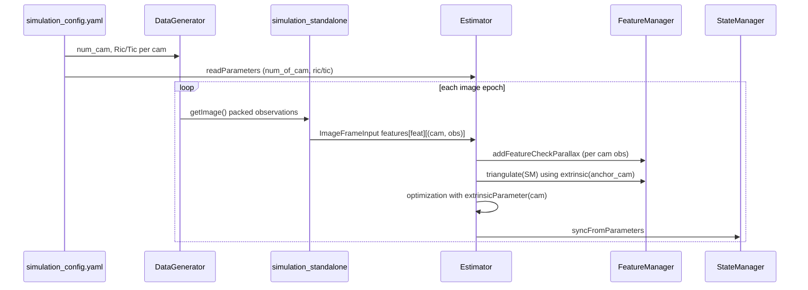

# 多目仿真与 VIO 支持设计（规划稿）

> **状态**：仅设计梳理，**不含实现**。  
> **目标**：`data_generator` 可按配置生成 1 / 2 / 4 路等图像观测（相机之间**可先无几何关联**）；`vins_estimator` 能消费多目 `ImageFrameInput` 并完成滑动窗口优化。  
> **前提**：单 IMU + 多相机外参已知或可配置；与现有 `StateManager` / `VinsParameters` 动态 `num_of_cam` 方向一致。

---

## 一、范围与非目标

### 1.1 本期范围（MVP）

| 项 | 说明 |
|----|------|
| 相机数量 | 配置项 `num_of_cam ∈ {1,2,4,...}`，与 `VinsParameters::numOfCam()` 一致 |
| 外参 | 每相机独立 `ric[i]`, `tic[i]`（IMU→相机），从 YAML 读取；**不要求**相机间标定关系 |
| 特征 | **每路相机独立 feature_id 与跟踪**（与当前 `data_generator` 每相机 `before_feature_id[k]` 一致）；不做跨相机关联路标 |
| 优化 | 各路观测使用对应 `extrinsicParameter(cam_id)` 参与 `ProjectionFactor` |
| 仿真入口 | `simulation_standalone` + `simulation_config.yaml` 驱动，指标回归可扩展多目配置 |

### 1.2 明确非目标（可后续单独立项）

- 相机间时间戳不对齐、独立 `td` per camera（先共用 `StateManager::td`）
- 跨相机同一 3D 点的 ID 关联、立体匹配、三角化融合（`data_generator` 里大段注释掉的 stereo 关联逻辑）
- 多目 + 回环 / 重定位（仓库未接入）
- ROS 真机多 topic 同步（standalone 先行）
- 每相机独立 `focal_length` / 图像分辨率（可先全局 `image_width/height`、`focal_length`）

---

## 二、现状盘点

### 2.1 已有、可复用能力

```
┌─────────────────────┐     packed_id = feat_id * N + cam_k
│   DataGenerator     │ ─────────────────────────────────────►
│ NUMBER_OF_CAMERA=1  │     pair<int, Vector3d>  (编译期常量)
│ Ric[k], Tic[k]      │
└─────────────────────┘
            │
            ▼
┌─────────────────────┐     unpack → feature_id, camera_id
│ simulation_standalone│     ImageFrameInput.features[feat_id][].emplace(cam, 7-vector)
└─────────────────────┘
            │
            ▼
┌─────────────────────┐     num_of_cam, ric_/tic_ vectors
│ VinsParameters      │     StateManager::para_ex_pose_[cam]
│ ImageFrameInput     │     map<feature_id, vector<pair<cam_id, obs>>>
└─────────────────────┘
```

| 模块 | 多目相关现状 |
|------|----------------|
| **`data_generator`** | 头文件/实现已按 `NUMBER_OF_CAMERA` 写循环、`Ric[k]/Tic[k]`、`getImage()` 打包 `id*N+k`；**当前编译为 1**；`k==1` 分支为硬编码立体特例，不能泛化到 4 目 |
| **`simulation_standalone`** | 已按 `numOfCam()` 解包 `packed_id`；`prev_uv` 仅按 `feature_id` 存，多目同 id 不同相机会冲突（若未来同 id 跨 cam 需改） |
| **`ImageFrameInput`** | 数据结构已支持「一路特征、一帧多相机观测」 |
| **`VinsParameters`** | `num_of_cam`、`ric/tic` 向量、`allocateStorage()` 按相机数分配 `para_ex_pose_` |
| **`Estimator::optimization`** | 循环 `numOfCam()` 添加外参块，但 **所有 `ProjectionFactor` 仍绑 `extrinsicParameter(0)`** |
| **`FeatureManager`** | `addFeatureCheckParallax` 只取 `id_pts.second[0]`，**丢弃同帧其余相机**；`triangulate` / `removeBackShiftDepth` 仅用 `extrinsic(0)` |
| **`parameters.cpp`** | `num_of_cam > 1` 时仍读**同一组** `extrinsicRotation/Translation` 复制到各相机（有 WARN） |

### 2.2 关键断裂点（必须改）

1. **配置层**：`data_generator` 编译期 `NUMBER_OF_CAMERA` 与 YAML `num_of_cam` **未打通**。  
2. **特征入窗**：`FeaturePerFrame` **无 `camera_id`**，无法区分锚定相机。  
3. **重投影**：优化与边缘化中 **`extrinsicParameter(0)` 写死**。  
4. **三角化 / 深度边缘化**：几何量一律用相机 0 外参。  
5. **仿真跟踪 ID**：多目独立 track 时 OK；若启用跨 cam 同 ID，需改 `prev_uv` 与 `addFeature` 语义。

---

## 三、配置设计

### 3.1 统一配置文件（推荐）

在 `config/simulation/simulation_config.yaml`（或独立 `config/simulation/multi_cam.yaml`）中扩展：

```yaml
num_of_cam: 2   # 1 | 2 | 4

# 每相机外参：IMU 系到相机系 ric, tic（与现 extrinsicRotation/Translation 语义一致）
# 方案 A：数组（推荐）
extrinsic_rotations:
  - { rows: 3, cols: 3, data: [...] }   # cam0
  - { rows: 3, cols: 3, data: [...] }   # cam1
extrinsic_translations:
  - { rows: 3, cols: 1, data: [...] }
  - { rows: 3, cols: 1, data: [...] }

# 方案 B：保留单组 + cam_extrinsics_file 指向 CSV（真机迁移友好）

# data_generator 专用（可与 vins 共用文件）
data_generator:
  num_points: 500
  fov_deg: 90
  imu_per_img: 50
  # 可选：每相机独立 FOV / 噪声，二期
```

### 3.2 配置加载职责

| 消费者 | 新增/调整 |
|--------|-----------|
| **`VinsParameters::loadFromConfig`** | 解析 `num_of_cam`；按相机数读取 `extrinsic_rotations/translations` 或列表；删除「多目复制同一 R/T」的临时行为 |
| **`DataGenerator`** | 构造时注入 `num_cam` + `vector<Ric,Tic>`（从同一 YAML 或 `DataGeneratorOptions`）；**去掉** `static const NUMBER_OF_CAMERA` 作为唯一真相 |
| **`simulation_standalone`** | `readParameters` 后把外参同步给 `DataGenerator`（或 generator 自己读同文件） |

### 3.3 约束校验

启动时检查：

- `num_of_cam == extrinsic_rotations.size() == extrinsic_translations.size()`
- `num_of_cam >= 1`，`max_feature_count` 建议 ≥ 每路预期路标数 × `num_of_cam`（或按路标池统一上限）
- `data_generator` 与 `vinsParameters().numOfCam()` **必须一致**（不一致则 `LOG` + 退出或强制对齐）

---

## 四、`data_generator` 改造清单

### 4.1 API 与构造

| 项 | 动作 |
|----|------|
| `DataGeneratorOptions` | 新增：`int num_cam`、`std::vector<Matrix3d> ric`、`std::vector<Vector3d> tic`、`int fov_deg`、`int num_points` 等 |
| 构造函数 | `DataGenerator(const DataGeneratorOptions&)` 或 `initFromYaml(path)` |
| 编译期常量 | `NUMBER_OF_CAMERA` 改为运行时 `num_cam_`，数组改 `std::vector`（`before_feature_id`、`Ric`、`Tic`） |

### 4.2 `getImage()` 逻辑

| 项 | 动作 |
|----|------|
| 投影循环 | 保持「每相机独立 FOV 筛选 + 独立 track map」 |
| 打包格式 | 保持 `packed_id = track_id * num_cam + cam_index`（与 standalone 约定一致） |
| **`k==1` 特例** | **删除或**改为配置项 `stereo_share_landmark_id: false`（默认 false：各相机独立 ID） |
| 跨相机关联 | 注释块（`ids[k]` 与 `ids[k+1]` 共享 `current_id`）保留为 **Phase 2**，本期不启用 |
| 调试输出 | `printf` 改为 `LOG_TXT` 或删除 |

### 4.3 与 VINS 外参一致性

- 仿真中 `DataGenerator::Ric/Tic` 应与 `VinsParameters::ric/tic` **同源配置**，避免仿真几何与优化外参不一致。
- 文档中给出 2 目 / 4 目示例外参（可基于现有 `Ric[1],Tic[1]`、`Ric[2]` 硬编码迁移到 YAML）。

### 4.4 可选增强（非 MVP）

- 每相机不同安装位姿、不同 FOV
- 按相机开关「是否输出观测」
- 输出带 `camera_id` 的 rosbag 式结构（为真机适配预留）

---

## 五、`vins_estimator` 改造清单

### 5.1 数据模型

| 类型 | 变更 |
|------|------|
| **`FeaturePerFrame`** | 增加 `int camera_id`；构造时传入 |
| **`FeaturePerId`** | 增加 `int anchor_cam`（首帧观测的相机，或 `feature_per_frame[0].camera_id`） |
| **`ImageFrameInput`** | 不变；约定 `features[feature_id]` 内可含多个 `(cam_id, obs)` |

### 5.2 `FeatureManager`

| 函数 | 变更 |
|------|------|
| **`addFeatureCheckParallax`** | 对 `id_pts.second` **遍历**每个 `(cam_id, obs)`，每个 push 一个 `FeaturePerFrame`（或按相机拆成多条 `FeaturePerId`，二选一，见下） |
| **路标组织策略** | **推荐 MVP**：一个 `FeaturePerId` 只对应一个 `camera_id`（与 data_generator 独立 track 一致）；同帧多 cam 不同 `feature_id` → 多条 `FeaturePerId` |
| **`triangulate`** | 使用 `state.extrinsic(anchor_cam)` 计算各帧 `R0,t0,R1,t1` |
| **`removeBackShiftDepth`** | `slideWindowOld` 传入的 `R0,P0,R1,P1` 使用 **锚定相机** 外参（`Estimator` 侧按 `anchor_cam` 算，而非写死 cam0） |
| **`compensatedParallax2`** | 使用锚定相机射线；多目时视差阈值可按相机分别统计或仍用主相机 |
| **`getFeatureCount` / `setDepth`** | 逻辑不变；注意 `feature_index` 与 `para_feature_` 一一对应 |

**备选（Phase 2）**：单个 `feature_id` 下挂多相机观测 → 需定义「主相机深度参数」或「每相机一个逆深度」，改动大，**不建议**放 MVP。

### 5.3 `Estimator`

| 函数 | 变更 |
|------|------|
| **`processImage`** | 已接收 `ImageFrameInput`；确认 `addFeatureCheckParallax` 多观测入窗 |
| **`optimization`** | 对每个 `ProjectionFactor`：`extrinsicParameter(it_per_frame.camera_id)`；`pts_i` 来自锚定相机首观测 |
| **边缘化视觉因子** | `MARGIN_OLD` / `MARGIN_SECOND_NEW` 分支中同样替换 `extrinsicParameter(0)` |
| **`slideWindowOld`** | `ex = state_.extrinsic(anchor_cam)`，anchor 来自被边缘化特征的 `FeaturePerId` 或统一用 slot0 锚定 cam（需统一规则） |
| **`failureDetection` / `solveOdometry`** | 无结构性变更；`last_track_num` 阈值可按 `num_of_cam` 缩放 |

### 5.4 `StateManager` / `VinsParameters`

| 项 | 现状 | 动作 |
|----|------|------|
| `para_ex_pose_[cam]` | 已按 `num_of_cam` 分配 | 确认 `syncTo/FromParameters` 覆盖全部相机 |
| `extrinsic(cam_id)` | 已有 | 全链路改用 `cam_id` |
| `estimate_extrinsic` | 全局一个开关 | MVP：仍全局；或 `estimate_extrinsic_per_cam`（二期） |
| `td` | 全局一个 | MVP：全局；多目独立 td 二期 |

### 5.5 `ProjectionFactor` / 测试

| 项 | 动作 |
|----|------|
| **`projection_factor.cpp`** | 已支持外参为参数块；补充 **多相机 ID** 的单元测试（cam0 vs cam1 不同 `tic`） |
| **`projection_factor_test`** | 增加 `num_of_cam=2` 配置加载用例 |
| **`sqrt_info`** | 现用全局 `focal_length`；多目同焦距可不变 |

### 5.6 `standalone/simulation_standalone.cpp`

| 项 | 动作 |
|------|------|
| 解包逻辑 | 保持 `feature_id = packed / N`，`camera_id = packed % N` |
| **`prev_uv`** | MVP：key 改为 `(feature_id, camera_id)` 或保持独立 feature_id（推荐后者，改动最小） |
| **指标** | 位置/速度误差仍对 IMU 状态；可增加每相机重投影误差统计（可选） |
| **Init** | `DataGenerator` 与 `readParameters` 共用配置 |

---

## 六、数据流（MVP 多目，相机不关联）



**特征 ID 约定（MVP）**：

- 相机 `k` 上 track id 为 `u` → `packed = u * num_cam + k`
- 解包后 `feature_id = u`（**每相机独立**），不同相机的同名 `u` **不是**同一路标。

---

## 七、测试与验收

| 层级 | 内容 |
|------|------|
| **配置** | `num_of_cam: 1` 指标与现 regression 一致；`2` / `4` 能跑通不崩溃 |
| **单元** | `ProjectionFactor` 两相机外参；`FeatureManager::addFeature` 多 `(cam,obs)`；`parameters` 多读 extrinsic 列表 |
| **集成** | `state_manager_smoke_test` 不变；`vins_simulation_standalone` 2cam/4cam 输出合理 `LOG_VALUE` |
| **回归脚本** | `check_simulation_metrics.sh` 增加 `simulation_config_2cam.yaml` 阈值（可放宽） |

---

## 八、分阶段实施建议

| 阶段 | 内容 | 依赖 |
|------|------|------|
| **P0** | 配置：`num_of_cam` + 每相机外参 YAML；`VinsParameters` 正确加载 | 无 |
| **P1** | `DataGenerator` 运行时多目；去掉 `k==1` 硬编码；与 YAML 对齐 | P0 |
| **P2** | `FeaturePerFrame::camera_id` + `addFeature` 遍历；`FeaturePerId::anchor_cam` | P0 |
| **P3** | `optimization` / 边缘化 `extrinsicParameter(cam)` | P2 |
| **P4** | `triangulate` + `removeBackShiftDepth` 锚定相机外参 | P2, P3 |
| **P5** | 测试、文档、2/4 目仿真 config 与 metrics | P1–P4 |
| **P6（可选）** | 跨相机关联路标、立体三角化、`compensatedParallax` 旋转补偿 | 产品需求 |

---

## 九、文件级改动索引（实现时对照）

| 路径 | 新增/重构 |
|------|-----------|
| `config/simulation/simulation_config_2cam.yaml` 等 | **新增** 多目配置样例 |
| `data_generator/src/data_generator.{h,cpp}` | **重构** 运行时 `num_cam`、可配置外参、清理 `getImage` 特例 |
| `data_generator/src/data_generator_options.h` | **新增**（可选） |
| `vins_estimator/src/parameters.{h,cpp}` | **扩展** 多 extrinsic 读取 |
| `vins_estimator/src/feature_manager.{h,cpp}` | **扩展** `camera_id`、多观测入窗、三角化/边缘化外参 |
| `vins_estimator/src/estimator.cpp` | **修改** 优化与 `slideWindowOld` 外参索引 |
| `standalone/simulation_standalone.cpp` | **小改** 注入 generator 配置、`prev_uv` 策略 |
| `tests/projection_factor_test.cpp` | **扩展** 多目外参 |
| `docs/state_manager_refactoring.md` | **补充** 交叉引用（可选） |
| `README.md` | **补充** 多目仿真运行说明（实现后） |

**预计不需改**：`StateManager` 窗口搬移逻辑、`IMUFactor`、`ImageFrameInput` 顶层结构（仅文档化约定）。

---

## 十、风险与决策点

| 风险 | 缓解 |
|------|------|
| `max_feature_count` 不足 | 配置说明建议按相机数放大；或按活跃路标动态扩容（大改） |
| 多目特征数翻倍导致实时性下降 | 降低 `NUM_POINTS` 或 `max_feature_count`；solver 时间配置 |
| 外参错误导致 2/4 目比单目更差 | 仿真同源外参；单测检查 `ProjectionFactor` 残差 |
| `addFeature` 同帧只取 `[0]` 的隐性 bug | P2 必须修；多目 MVP 的前置条件 |

**待产品确认**：

1. MVP 是否坚持「相机间路标 ID 独立」？（推荐是，与「先不相关」一致）  
2. `num_of_cam=4` 时是否接受四路独立单目 VIO 拼在一个 IMU 上？（是则实现简单）  
3. 是否需要每相机独立图像尺寸 / 内参？

---

## 十一、与现有文档关系

- 窗口与参数布局：见 `docs/state_manager_refactoring.md` §十二（`num_of_cam`、`ric/tic` 向量）。  
- 投影因子接口：见 `docs/projection_factor_engineering_notes.md`。  
- 本文档为实现多目时的**主设计入口**；实现完成后在 §十一「实现状态」增加多目验收记录。
