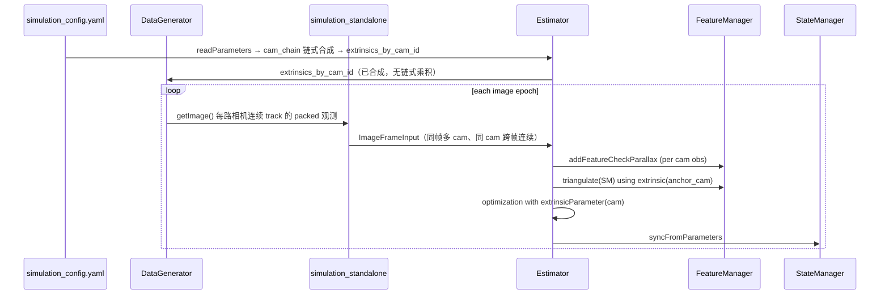

# 多目仿真与 VIO 支持设计（规划稿）

> **状态**：仅设计梳理，**不含实现**。  
> **目标**：`data_generator` 可按配置生成 1 / 2 / 4 路等图像观测（相机之间**可先无几何关联**）；`vins_estimator` 能消费多目 `ImageFrameInput` 并完成滑动窗口优化。  
> **前提**：单 IMU + 多相机外参已知或可配置；与现有 `StateManager` / `VinsParameters` 动态 `num_of_cam` 方向一致。

---

## 一、范围与非目标

### 1.1 本期范围（MVP）

| 项 | 说明 |
|----|------|
| 相机数量 | 配置项 `num_of_cam ∈ {1,2,4,...}`，与 `VinsParameters::numOfCam()` 一致 |
| 外参 | 以**物理 `cam_id` 为键**的 `std::unordered_map<int, ExtrinsicState>`（`ric`/`tic`，IMU→相机）；Kalibr `cam_chain` / `cam_chain-imucam` 在 **`readParameters` 读取时**完成 `T_cn_cnm1` 链式乘积，写入 map；运行时只查表，**不再**做链式变换 |
| 特征 | **每路相机独立 feature_id 与跟踪**（与当前 `data_generator` 每相机 `before_feature_id[k]` 一致）；不做跨相机关联路标 |
| **仿真观测生成** | `DataGenerator::getImage()` 在 **`num_of_cam ≥ 2`** 时，**每路相机**均输出带 `packed_id` 的归一化射线观测；**同相机跨帧 track_id 连续**（`gr_ids`→`before_feature_id[k]` 映射），保证 VIO 能积累 `used_num ≥ 2` 的轨迹 |
| 时间延迟 | 各相机 **td 暂时相同**，共用 `StateManager::td` / `para_Td`（单参数块） |
| 重投影约束 | **仅帧间**（同 track、同 `anchor_cam` 的 `imu_i→imu_j`）；**不做相机间**（同帧 cam0↔cam1 立体/跨目残差）；**约束添加代码**须支持多相机观测入窗并按 `camera_id` 绑定 `extrinsicParameter(slot)` |
| 仿真入口 | `simulation_standalone` + `simulation_config.yaml` 驱动；**必须**走完整多目观测管线（generator 多路输出 → 解包 → `ImageFrameInput`），指标回归扩展 `2cam`/`4cam` 配置 |

### 1.2 明确非目标（可后续单独立项）

- 相机间时间戳不对齐、**每相机独立 `td`**（MVP **假定各相机 td 相同**，共用 `StateManager::td`）
- 跨相机同一 3D 点的 ID 关联、立体匹配、三角化融合（`data_generator` 里大段注释掉的 stereo 关联逻辑）
- **同帧相机间重投影约束**（立体/多目 BA 式「一路标、多相机、同一时刻」残差）；MVP 仅帧间 VIO 约束，多相机通过**多路独立 track** 并行提供观测
- 多目 + 回环 / 重定位（仓库未接入）
- ROS 真机多 topic 同步（standalone 先行）
- 每相机独立 `focal_length` / 图像分辨率（MVP 仍用全局 `image_width/height`、`focal_length`）

---

## 二、现状盘点

### 2.1 已有、可复用能力

```
┌─────────────────────┐     packed_id = feat_id * N + cam_k
│   DataGenerator     │ ─────────────────────────────────────►
│ NUMBER_OF_CAMERA=1  │     pair<int, Vector3d>  (编译期常量)
│ Ric/Tic by cam_id   │
└─────────────────────┘
            │
            ▼
┌─────────────────────┐     unpack → feature_id, camera_id
│ simulation_standalone│     ImageFrameInput.features[feat_id][].emplace(cam, 7-vector)
└─────────────────────┘
            │
            ▼
┌─────────────────────┐     num_of_cam, camera_ids[slot]
│ VinsParameters      │     extrinsics_by_cam_id[cam_id] → {ric,tic}（加载期链式合成）
│ ImageFrameInput     │     StateManager::para_ex_pose_[slot]（Ceres 按 slot）
└─────────────────────┘     map<feature_id, vector<pair<cam_id, obs>>>
```

| 模块 | 多目相关现状 |
|------|----------------|
| **`data_generator`** | 头文件/实现已按 `NUMBER_OF_CAMERA` 写循环、`Ric[k]/Tic[k]`、`getImage()` 打包 `id*N+k`；**当前编译为 1**；`k==1` 分支为硬编码立体特例，不能泛化到 4 目 |
| **`simulation_standalone`** | 已按 `numOfCam()` 解包 `packed_id`；`prev_uv` 仅按 `feature_id` 存，多目同 id 不同相机会冲突（若未来同 id 跨 cam 需改） |
| **`ImageFrameInput`** | 数据结构已支持「一路特征、一帧多相机观测」 |
| **`VinsParameters`** | `num_of_cam`、`camera_ids`；外参目标形态为 `unordered_map<int, ExtrinsicState>`（实现中可由 `cam_chain` 加载后填充）；`allocateStorage()` 按 slot 分配 `para_ex_pose_` |
| **`cam_chain.*`** | `CamChainFile` 解析 Kalibr 链；`applyCameraSetup` / `imuExtrinsicForCamera` 在加载时把 `T_cam_imu` + `T_cn_cnm1` 合成每路 **IMU→cam_id** 的 `ric/tic` |
| **`Estimator::optimization`** | 残差拓扑仍为 **帧间** `pose[i]↔pose[j]`；但 `AddResidualBlock` **写死 `extrinsicParameter(0)`**，多相机观测入窗后外参索引错误 |
| **`FeatureManager`** | `addFeatureCheckParallax` 只取 `id_pts.second[0]`，**丢弃同帧其余相机**；`triangulate` / `removeBackShiftDepth` 仅用 `extrinsic(0)` |
| **`parameters.cpp`** | 优先 `cam_chain_file` + `cam_chain_imu_file`；legacy 单组 `extrinsicRotation/Translation` 仅作 cam0 回退；链式合成在 `loadFromCamChains` 内完成，结果按 **`camera_ids` 列表**写入外参 map（过渡期可能仍为 `vector` 按 slot 存，与 map 同步） |

### 2.2 关键断裂点（必须改）

1. **配置层**：`data_generator` 编译期 `NUMBER_OF_CAMERA` 与 YAML `num_of_cam` **未打通**。  
2. **特征入窗**：`FeaturePerFrame` **无 `camera_id`**，无法区分锚定相机。  
3. **重投影（约束添加，非约束拓扑）**：MVP **保持仅帧间约束**（不对同帧多相机加立体残差）；但 `optimization` / 边缘化里遍历 `feature_per_frame` 时须带 **`camera_id`**，按观测相机绑定 `extrinsicParameter(slot)`，**禁止**再写死 `extrinsicParameter(0)`。现状：多相机观测即使入窗，残差仍全部用 cam0 外参。  
4. **三角化 / 深度边缘化**：几何量一律用相机 0 外参。  
5. **仿真多目观测不连续 / 不完整**：`NUMBER_OF_CAMERA=1` 时 generator 未真正多路输出；`k==1` 分支导致 cam1 观测依赖 cam0 历史 map，**破坏**独立 track 与帧间连续性；`num_points` 未按相机数放大时，单路可见路标过少。  
6. **仿真跟踪 ID**：MVP 为每相机独立 track；若启用跨 cam 同 ID，需改 `prev_uv` 与 `addFeature` 语义。

---

## 三、配置与外参模型

### 3.1 外参存储（权威语义）

| 概念 | 说明 |
|------|------|
| **`cam_id`** | 物理相机编号（可与 Kalibr `cam0/cam1` 一致，也可非连续，如 `[0,2]`） |
| **`camera_ids[slot]`** | 滑动窗口 / Ceres **slot** `0..num_of_cam-1` 到 `cam_id` 的映射 |
| **`extrinsics_by_cam_id`** | `std::unordered_map<int, ExtrinsicState>`，`ExtrinsicState::{ric,tic}` 为 **IMU→该相机**（`p_imu = ric * p_cam + tic`） |
| **链式标定** | YAML 只存原始边：`cam_chain-imucam` 的 `T_cam_imu`（cam0）、`cam_chain` 的 `T_cn_cnm1`（cam n 相对 n-1）；**不在** `ProjectionFactor` / `triangulate` 里连乘 |

> **不要求**事先给定相机间全局标定文件以外的关系；若配置里只有 cam0 的 `T_cam_imu` 且无 stereo 链，则 map 中仅 `cam_id=0` 有效。

### 3.2 统一配置文件（推荐）

主配置 `simulation_config.yaml`：

```yaml
num_of_cam: 2
camera_ids: [0, 1]   # slot0→cam0, slot1→cam1；可非连续如 [0, 2]

# 外参来源（推荐）：Kalibr 链文件，加载时链式合成进 extrinsics_by_cam_id
cam_chain_imu_file: cam_chain-imucam.yaml   # cam0: T_cam_imu
cam_chain_file: cam_chain.yaml              # cam1..N: T_cn_cnm1

# Legacy 回退：仅 cam0，无 stereo 链时
# extrinsicRotation / extrinsicTranslation

data_generator:
  num_points: 500
  fov_deg: 90
  imu_per_img: 50
```

**不推荐**在主 YAML 里为每路手写 `ric/tic` 数组（易与链文件不一致）；若必须手写，也应经同一加载函数写入 `extrinsics_by_cam_id`，而不是按 slot 下标 `i` 直接当 `cam_id`。

### 3.3 配置加载职责（链式变换在读取时完成）

```
cam_chain-imucam.yaml ──► T_cam_imu (cam0)
cam_chain.yaml        ──► T_cn_cnm1 链
         │
         ▼  loadCamChainYaml + imuExtrinsicForCamera(cam_id)  【仅此阶段】
         ▼
extrinsics_by_cam_id[cam_id] = { ric, tic }
         │
         ├─► VinsParameters（查询、日志、同步给 DataGenerator）
         └─► StateManager::initFromConfig / setExtrinsic(cam_id, …) 按 slot 顺序填入 para_Ex_Pose_[slot]
```

| 步骤 | 模块 | 动作 |
|------|------|------|
| 1 | `loadCamChainYaml` | 解析链文件 → `CamChainFile::cameras`（`map<int,CamNode>`，与 `unordered_map` 等价职责） |
| 2 | `imuExtrinsicForCamera` | `cam_id==0`：`ricTicFromTCamImu(T_cam_imu)`；`cam_id>0`：连乘 `T_cn_cnm1` 再左乘 `T_imu_c0` |
| 3 | `applyCameraSetup` | 对每个 `camera_ids[slot]` 调用上一步，**写入** `extrinsics_by_cam_id[cam_id]` |
| 4 | `StateManager` | `extrinsic(cam_id)` / `extrinsicParameter(slot)` 通过 `camera_ids[slot]` 查 map；优化期 **O(1) 查表** |
| **`DataGenerator`** | `readParameters` 后从 `extrinsics_by_cam_id` 拷贝到 `Ric[cam_id]`（或按 slot 列表），**不再**读链文件 |
| **`simulation_standalone`** | 只调 `readParameters`；禁止在仿真循环里做外参链式乘积 |

### 3.4 约束校验

启动时检查：

- `num_of_cam == camera_ids.size()`
- 对每个 `cam_id ∈ camera_ids`：`extrinsics_by_cam_id.count(cam_id) == 1`
- 若使用 `cam_chain_file`：`cam_id > 0` 时 stereo 链必须包含 `1..cam_id` 的 `T_cn_cnm1`（与 `imuExtrinsicForCamera` 一致）
- `num_of_cam >= 1`；`max_feature_count` 建议按相机数放大
- `data_generator` 与 `vinsParameters().numOfCam()` **必须一致**

---

## 四、`data_generator` 改造清单

### 4.1 API 与构造

| 项 | 动作 |
|----|------|
| `DataGeneratorOptions` | 新增：`int num_cam`、`std::vector<Matrix3d> ric`、`std::vector<Vector3d> tic`、`int fov_deg`、`int num_points` 等 |
| 构造函数 | `DataGenerator(const DataGeneratorOptions&)` 或 `initFromYaml(path)` |
| 编译期常量 | `NUMBER_OF_CAMERA` 改为运行时 `num_cam_`，数组改 `std::vector`（`before_feature_id`、`Ric`、`Tic`） |

### 4.2 `getImage()` 逻辑（多目观测 + 连续性）

**目标**：每个图像时刻，对 `k = 0 .. num_cam-1` 均产生**充分、连续**的特征观测，供 `FeatureManager` 建轨与 `ProjectionFactor` 使用。

| 项 | 动作 |
|----|------|
| 投影循环 | **每相机**独立：世界路标 → `Ric[k]/Tic[k]` → FOV 筛选 → 当前帧可见点列表 `cur_pts[k]` |
| **帧间 track 连续** | 每相机维护 `before_feature_id[k]`：`gr_ids[k][i]`（路标池下标）→ `track_id`；新点分配 `current_id++`；帧末 `swap` 更新 map，**禁止**仅 cam0 可见时才给 cam1 发观测（删除 `k==1` 特例） |
| **观测充分性** | 配置 `num_points`（或 `data_generator.num_points`）建议按 `num_cam` 放大，使每路 FOV 内平均每帧可见特征数 ≥ 单目回归量级；启动后可 `LOG` 每路 `ids[k].size()` 作冒烟检查 |
| **同帧同步** | 所有相机共用同一 IMU 位姿时刻生成观测（与现逻辑一致）；`simulation_standalone` 一次 `getImage()` 解包为**同一** `ImageFrameInput` 的多 `(cam_id, obs)` |
| 打包格式 | `packed_id = track_id * num_cam + k`；解包 `feature_id = packed / N`，`camera_id = packed % N` |
| 7-vector 观测 | 保持 `xyz + uv + velocity`；`simulation_standalone` 的 `prev_uv` 在 MVP 下按**独立 feature_id**（已含 cam 维度）算速度，保证连续帧差分有效 |
| 跨相机关联 | 注释块（跨 cam 共享 `current_id`）为 **Phase 2**；MVP **不启用**，避免破坏「每相机独立 track」语义 |
| 调试输出 | `printf` 改为 `LOG_TXT` 或删除 |

**连续性验收（generator 层）**：

- 固定某 `k`，同一 `gr_ids` 在连续多帧出现在 FOV 内时，`packed_id` 中 `track_id` 不变。  
- `num_of_cam=2/4` 时，每帧 `image.size()` 应约为单目的 `num_cam` 倍（同一场景点被多路同时看到时略少，但每路单独计数应稳定）。  
- 运行 100+ 帧后，随机抽样若干 `feature_id`，在 `FeatureManager` 中 `feature_per_frame.size() ≥ 2` 的比例应接近单目水平。

### 4.3 与 VINS 外参一致性

- `DataGenerator` 只消费 **`readParameters` 之后** 的 `extrinsics_by_cam_id`（或等价 getter），与 `StateManager` **同一套** IMU→相机变换。
- 链式标定**仅**在 `cam_chain` 加载阶段执行一次；generator 内禁止重复 `T_cn_cnm1` 连乘。
- 2 目 / 4 目示例：提供 `cam_chain.yaml` + `cam_chain-imucam.yaml` 样例，而非在 C++ 硬编码 `Ric[k]`。

### 4.4 可选增强（非 MVP）

- 每相机不同安装位姿、不同 FOV
- 按相机开关「是否输出观测」
- 输出带 `camera_id` 的 rosbag 式结构（为真机适配预留）

---

## 五、`vins_estimator` 改造清单

### 5.1 数据模型

| 类型 | 变更 |
|------|------|
| **`FeaturePerFrame`** | 增加 `int camera_id`；构造时传入 |
| **`FeaturePerId`** | 增加 `int anchor_cam`（首帧观测的相机，或 `feature_per_frame[0].camera_id`） |
| **`ImageFrameInput`** | 不变；约定 `features[feature_id]` 内可含多个 `(cam_id, obs)` |

### 5.2 `FeatureManager`

| 函数 | 变更 |
|------|------|
| **`addFeatureCheckParallax`** | 对 `id_pts.second` **遍历**每个 `(cam_id, obs)`，每个 push 一个 `FeaturePerFrame`（或按相机拆成多条 `FeaturePerId`，二选一，见下） |
| **路标组织策略** | **推荐 MVP**：一个 `FeaturePerId` 只对应一个 `camera_id`（与 data_generator 独立 track 一致）；同帧多 cam 不同 `feature_id` → 多条 `FeaturePerId` |
| **`triangulate`** | 使用 `state.extrinsic(anchor_cam)` 计算各帧 `R0,t0,R1,t1` |
| **`removeBackShiftDepth`** | `slideWindowOld` 传入的 `R0,P0,R1,P1` 使用 **锚定相机** 外参（`Estimator` 侧按 `anchor_cam` 算，而非写死 cam0） |
| **`compensatedParallax2`** | 使用锚定相机射线；多目时视差阈值可按相机分别统计或仍用主相机 |
| **`getFeatureCount` / `setDepth`** | 逻辑不变；注意 `feature_index` 与 `para_feature_` 一一对应 |

**备选（Phase 2）**：单个 `feature_id` 下挂多相机观测 → 需定义「主相机深度参数」或「每相机一个逆深度」，改动大，**不建议**放 MVP。

### 5.3 `Estimator` 与重投影约束语义

**MVP 约束拓扑（不变）**：

```
FeaturePerId（单 anchor_cam，单路 track）
  └─ feature_per_frame[0..n]  按时间排列
       └─ 仅添加 (imu_i, imu_j) 且 imu_j = imu_i + 1 的 ProjectionFactor
            （与现 VINS-Mono 单目一致，无「同帧 cam_a ↔ cam_b」边）
```

**须改的是约束添加（数据面 + 参数绑定）**：

| 函数 | 变更 |
|------|------|
| **`processImage`** | 已接收 `ImageFrameInput`；`addFeatureCheckParallax` 将多 `(cam_id, obs)` 拆成多条 **单相机** `FeaturePerId`（或等价结构），保证后续循环不会出现跨相机帧对 |
| **`optimization`** | 双重循环不变（`imu_i`/`imu_j` 沿时间）；对每个 `FeaturePerFrame` 取 `cam_id` → `extrinsicParameter(slotOf(cam_id))`；`pts_i` 取**该 track 锚定相机**首帧观测；**不**新增 cam 间 `AddResidualBlock` |
| **边缘化视觉因子** | `MARGIN_OLD` / `MARGIN_SECOND_NEW` 与主优化相同：`camera_id` + 对应外参块，拓扑仍帧间 |
| **Phase 2（非 MVP）** | 若未来「一路标多相机同帧」：需新残差类型或扩展 `ProjectionFactor` 连接 `(pose, ex_a), (pose, ex_b)`；**本期不做** |
| **`slideWindowOld`** | `ex = state_.extrinsic(anchor_cam)`，anchor 来自被边缘化特征的 `FeaturePerId` 或统一用 slot0 锚定 cam（需统一规则） |
| **`failureDetection` / `solveOdometry`** | 无结构性变更；`last_track_num` 阈值可按 `num_of_cam` 缩放 |

### 5.4 `StateManager` / `VinsParameters`

| 项 | 现状 | 动作 |
|----|------|------|
| **`VinsParameters`** | `vector ric_/tic_` 按 slot | 改为（或增加）`std::unordered_map<int, ExtrinsicState> extrinsics_by_cam_id_`；`loadFromCamChains` 填充；`ric(slot)` 可薄封装为 `extrinsics_by_cam_id_.at(cameraId(slot))` |
| `para_Ex_Pose_[slot]` | Ceres 按 slot 连续 | 保持；`syncTo/FromParameters` 在 slot↔`cam_id` 间同步 |
| `extrinsic(cam_id)` | 当前按 slot 下标 | **改为按物理 `cam_id` 查 map**；`extrinsicParameter(slot)` 内部 `camera_ids[slot]` 转 `cam_id` |
| `setExtrinsic(cam_id, …)` | — | 仅用于加载后注入或在线标定写回 map |
| `estimate_extrinsic` | 全局开关 | MVP 仍全局；二期可按 `cam_id` 冻结子集 |
| `td` | 全局一个 | **MVP：各相机 td 相同**；`ProjectionFactor` 共用 `timeDelayParameter()`；per-`cam_id` 独立 td 为二期 |

### 5.5 `ProjectionFactor` / 测试

| 项 | 动作 |
|----|------|
| **`projection_factor.cpp`** | 已支持外参为参数块；补充 **多相机 ID** 的单元测试（cam0 vs cam1 不同 `tic`） |
| **`projection_factor_test`** | 增加 `num_of_cam=2` 配置加载用例 |
| **`sqrt_info`** | 现用全局 `focal_length`；多目同焦距可不变 |

### 5.6 `standalone/simulation_standalone.cpp`

| 项 | 动作 |
|------|------|
| **多目观测接入** | 每图像时刻调用一次 `getImage()`，将**所有相机**观测写入同一 `ImageFrameInput`（`features[feat_id].emplace_back(cam_id, 7-vector)`），不得只消费 cam0 |
| 解包逻辑 | `feature_id = packed / N`，`camera_id = packed % N`；`N = numOfCam()` |
| **`prev_uv`** | MVP：保持**独立 feature_id**（packed 解包后已区分相机），保证 UV 速度来自同相机连续帧 |
| **连续性辅助** | 可选：统计每帧每 `cam_id` 观测数、每 track 寿命，写入 `LOG_VALUE` 或断言下限（防止「有多目配置但观测枯竭」） |
| **指标** | 位置/速度误差仍对 IMU 状态；`check_simulation_metrics.sh` 增加 `simulation_config_2cam.yaml` / `4cam`（阈值可略宽，但须无 crash 且 track 数达标） |
| **Init** | `readParameters` 后构造 `DataGenerator`，注入与 `extrinsics_by_cam_id` 一致的 `num_cam`、外参 |

---

## 六、数据流（MVP 多目，相机不关联）



**特征 ID 约定（MVP）**：

- 相机 `k` 上 track id 为 `u` → `packed = u * num_cam + k`
- 解包后 `feature_id = u`（**每相机独立**），不同相机的同名 `u` **不是**同一路标。

---

## 七、测试与验收

| 层级 | 内容 |
|------|------|
| **配置** | `num_of_cam: 1` 指标与现 regression 一致；`2` / `4` 能跑通不崩溃 |
| **仿真观测** | 每帧每路 `cam_id` 观测数 > 阈值；同一 `packed_id` 跨 ≥2 帧可追踪；无「仅 cam0 有特征」退化 |
| **单元** | `ProjectionFactor` 两相机外参；`FeatureManager::addFeature` 多 `(cam,obs)`；`parameters` 多读 extrinsic 列表 |
| **集成** | `state_manager_smoke_test` 不变；`vins_multi_simulation` 2cam/4cam 输出合理 `LOG_VALUE` 且 `last_track_num` 不低于单目同比例 |
| **回归脚本** | `check_simulation_metrics.sh` 增加 `simulation_config_2cam.yaml` 阈值（可放宽）；可选 `--min-obs-per-cam` 检查 |

---

## 八、分阶段实施建议

| 阶段 | 内容 | 依赖 |
|------|------|------|
| **P0** | `camera_ids` + `cam_chain*` 加载；`extrinsics_by_cam_id` 在读取时链式合成；`VinsParameters` / `StateManager` 按 `cam_id` 查表 | 无 |
| **P1** | `DataGenerator` 运行时多目；**每路连续 track + 充分观测**；去掉 `k==1` 硬编码；与 YAML 对齐 | P0 |
| **P2** | `FeaturePerFrame::camera_id` + `addFeature` 遍历；`FeaturePerId::anchor_cam` | P0 |
| **P3** | `optimization` / 边缘化 `extrinsicParameter(cam)` | P2 |
| **P4** | `triangulate` + `removeBackShiftDepth` 锚定相机外参 | P2, P3 |
| **P5** | 测试、文档、2/4 目仿真 config 与 metrics | P1–P4 |
| **P6（可选）** | 跨相机关联路标、立体三角化、`compensatedParallax` 旋转补偿 | 产品需求 |

---

## 九、文件级改动索引（实现时对照）

| 路径 | 新增/重构 |
|------|-----------|
| `config/simulation/simulation_config_2cam.yaml` 等 | **新增** 多目配置样例 |
| `data_generator/src/data_generator.{h,cpp}` | **重构** 运行时 `num_cam`、可配置外参、清理 `getImage` 特例 |
| `data_generator/src/data_generator_options.h` | **新增**（可选） |
| `vins_estimator/src/parameters.{h,cpp}` | **扩展** `unordered_map<int, ExtrinsicState>`；加载期写入（`cam_chain` 已有链式逻辑，迁出 vector 语义） |
| `vins_estimator/src/state_manager.{h,cpp}` | **修改** `extrinsic(cam_id)` 查 map；`para_Ex_Pose_[slot]` 与 `camera_ids` 对齐 |
| `vins_estimator/src/feature_manager.{h,cpp}` | **扩展** `camera_id`、多观测入窗、三角化/边缘化外参 |
| `vins_estimator/src/estimator.cpp` | **修改** 优化与 `slideWindowOld` 外参索引 |
| `standalone/simulation_standalone.cpp` | **小改** 注入 generator 配置、`prev_uv` 策略 |
| `tests/projection_factor_test.cpp` | **扩展** 多目外参 |
| `docs/state_manager_refactoring.md` | **补充** 交叉引用（可选） |
| `README.md` | **补充** 多目仿真运行说明（实现后） |

**预计不需改**：`StateManager` 窗口搬移逻辑、`IMUFactor`、`ImageFrameInput` 顶层结构（仅文档化约定）。  
**需改**：`StateManager::extrinsic(int)` 的索引语义（slot → `cam_id` + map）。

---

## 十、风险与决策点

| 风险 | 缓解 |
|------|------|
| `max_feature_count` 不足 | 配置说明建议按相机数放大；或按活跃路标动态扩容（大改） |
| 多目特征数翻倍导致实时性下降 | 降低 `NUM_POINTS` 或 `max_feature_count`；solver 时间配置 |
| 外参错误导致 2/4 目比单目更差 | 仿真同源外参；单测检查 `ProjectionFactor` 残差 |
| `addFeature` 同帧只取 `[0]` 的隐性 bug | P2 必须修；多目 MVP 的前置条件 |

**待产品确认**：

1. MVP 是否坚持「相机间路标 ID 独立」？（推荐是，与「先不相关」一致）  
2. `num_of_cam=4` 时是否接受四路独立单目 VIO 拼在一个 IMU 上？（是则实现简单）  
3. 是否需要每相机独立图像尺寸 / 内参？

---

## 十一、与现有文档关系

- 窗口与参数布局：见 `docs/state_manager_refactoring.md`（`num_of_cam`、`extrinsic(cam_id)`；多目外参以 **`cam_id`→map** 为准，非 `ric[i]` 槽位数组）。  
- 投影因子接口：见 `docs/projection_factor_engineering_notes.md`。  
- 本文档为实现多目时的**主设计入口**；实现完成后在 §十一「实现状态」增加多目验收记录。
